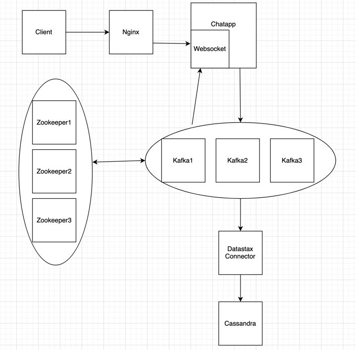

## This application is called lessenger.

It is a shell based instant messaging application.
This is a multi module maven project which produces jar files and docker images as the artifacts for each module. 
Technologies used in this project are;
1. Docker
2. Spring Boot
3. Websockets
4. Nginx
5. Kafka
4. Zookeeper
6. Datastax-connect
7. cassandra

To run the application follow these steps
1. `mvn clean compile package`
2. `docker-compose up`
3. run the client using `java -jar client/target/Client-1.0-SNAPSHOT-jar-with-dependencies.jar`

A video walkthrough of the application can be viewed here: [Lessenger.mp4](https://drive.google.com/file/d/1v8z4sN85QVbf02Tk_ZzQMueJ59y2xi2v/view)

A report with more information on this project can be viewed here (Google Doc): [Report](https://docs.google.com/document/d/1wI2uyOCUp9UZqhcLZ9gRFrJ52dO5uFmabp6oAi8LsbM/edit)

A PDF version of the report can be found here: [PDF REPORT](https://drive.google.com/file/d/1kBJLpUjGSmXht7hJ6ZkWcIPEpw7YK-L8/view?usp=sharing)

See the architecture diagram below

